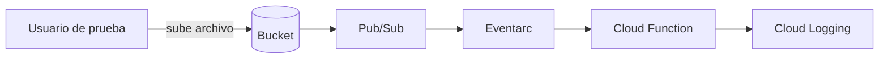

# automated-deliverable-control
Automatización en GCP: al subir un archivo a Cloud Storage, una Cloud Function lo valida y registra en Cloud Logging. Periodo de prueba GCP | Workspace.

## **Que hace**
Es básicamente un buzón de entregables en la nube. Cuando alguien sube un archivo a un bucket de Cloud Storage, una Cloud Function se activa sola, procede a leer los datos del archivo (Nombre, Tipo y tamaño), los valida contra tres reglas y deja el resultado registrado en Cloud Logging.

El objetivo principal es eliminar el trabajo manual de revisar una carpeta para saber qué cosa llegó y si todo está correcto. en los siguientes días 2 y 3 este registro se conectará con Google Sheets, Gmail y calendar.


## Componentes

| Servicio | Para qué se usa |
|---|---|
| Cloud Storage | Recibe los archivos y dispara el flujo |
| Pub/Sub | Transporta el aviso de que llegó un archivo |
| Eventarc | Conecta ese aviso con la función |
| Cloud Functions | Lee, valida y registra cada archivo |
| Cloud Loggin | Guarda el resultado de cada ejecución |
| Cloud Build y Artifact Registry | Construyen y guardan la función al desplegarla |
| IAM | Define qué puede hacer cada identidad |

## Estructura de repositorio

```
automated-deliverable-control/
├── README.md
├── setup.sh
└── cloud-function/
   ├── main.py
   ├── requirements.txt
   └── test_main.py
```
## paso a paso

La mayoria de los servicios o caracteristicas fueron desplegadas en cloud shell, y algunas caracteristicas directo desde la consola, en la region **us-central1**. El archivo **setup.sh** reune los comandos utilizados en orden.

## 1. proyecto y presupuesto (por consola)
  - se tiene una alerta de presupuesto de 5 USD (Solo alertas) con umbrales de 50%, 90% y 100%.
  - 


## 2. APIs utlizadas
```
gcloud services enable storage.googleapis.com cloudfunctions.googleapis.com \
  run.googleapis.com eventarc.googleapis.com pubsub.googleapis.com \
  logging.googleapis.com cloudbuild.googleapis.com artifactregistry.googleapis.com
```
El proyecto pide cinco APIs, pero se agregaron cloud run, eventarc y artifact registry porque, sin ellas una uncion con trigger de sotrage no se puede desplegar


## 3. Identidades y permisos (mínimo privilegio)

| Identidad | Rol | Sobre qué | Por qué |
|--|--|--|--|
|sa-procesador (ejecuta la función)|ninguno|-|el eveno ya trae los datos del archivo|
|sa-eventarc (invoca la función)|receptor de eventos de eventarc|proyecto|recibir los eventos|
|sa-eventarc|	Invocador de Cloud Run|Solo la función|Poder llamarla|
|Agente de Cloud Storage|Publicador de Pub/Sub|Proyecto|Publicar el aviso de que llegó un archivo|
|Cuenta de build|Cloud Build Builder|Proyecto|Construir la función|
|Usuario de prueba|Creador de objetos de Storage|Solo el bucket|Subir archivos sin poder ver, borrar ni sobrescribir|

## 4. Bucket
  - Nombre: entregables-automated-deliverable-control, en us-central1
  - acceso uniforme y acceso público bloqueado.
  - ciclo de vida: pasa a nearline a los 7 dias (más barato para archivos que ya casi no se abren) y se borra a los 30 días (para que no se exceda de documentos)


## 5. cloud function

```
gcloud functions deploy procesar-entregable --gen2 --runtime=python312 \
  --region=us-central1 --source=./cloud-function --entry-point=procesar \
  --trigger-event-filters="type=google.cloud.storage.object.v1.finalized" \
  --trigger-event-filters="bucket=entregables-automated-deliverable-control" \
  --service-account=sa-procesador@automated-deliverable-control.iam.gserviceaccount.com \
  --trigger-service-account=sa-eventarc@automated-deliverable-control.iam.gserviceaccount.com \
  --memory=256Mi --max-instances=3
```
Estos comandos nos ayudan a desplegar nuestro codigo, donde valida 3 reglas:
  - el nombre debe llevar guion
  - el tipo debe ser pdf, jpg o png
  - el tamaño no debe pasar de 10MB

## 6. Pruebas unitarias

```
cd cloud-function
pytest -v
```

se revisan 8 pruebas: 5 revisan las reglas de validación (incluido el caso límite de exactamente 10mb) y 3 revisan la función compelta con un evento simulado, tanto en el flujo exitoso como con eventos incompletos o con datos inválidos


## 7. permisos del usuario de prueba

| Acción | Esperado | Obtenido |
|--|--|--|
|Subir archivo|Permitido|Permitido|
|Listar el bucket|Denegado|Denegado|
|Leer un archivo|Denegado|Denegado|
|Borrar|Denegado|Denegado|
|Sobrescribir|Denegado|Denegado|

## DIA 2 - AUTOMATIZACIÓN EN GOOGLE WORKSPACE

El registro y las notificaciones se automatizan con google apps scritp.

## Flujo

Peticion POST → doPost valida y escribe la fila en el Sheet
→ si el estado es ERROR, manda un correo inmediato
→ envia un resumen diario al fianl del dia + un evento en google calendar
→ cuando la revisora cambia el estado, se escribe la fecha de cierre y se avisa

## componentes

| Función | Qué hace | Disparador |
|---|---|---|
| doPost | Recibe los metadatos y escribe la fila | Petición a la URL de la web app |
| resumenDiario | Cuenta el día, manda el resumen y agenda la revisión | activador por horario |
| alEditar | Escribe la fecha de cierre y avisa del resultado | Activador instalable Al editar |

## decisiones tecnicas

- **La columna Generation es texto**: con 16 dígitos, Sheets alteraría el último si fuera número.
- **El estado se elige de un desplegable**: el código compara textos exactos.
- **notificaciones**: inmediata solo para errores, y el resto en el resumen diario.
- **Un solo evento de Calendar al día**: uno por archivo saturaría el calendario.
- **Permisos por grupo**: el Sheet se comparte con adc-revisores, no con personas.
